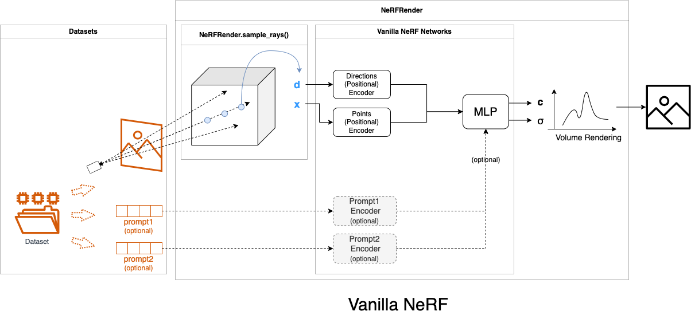
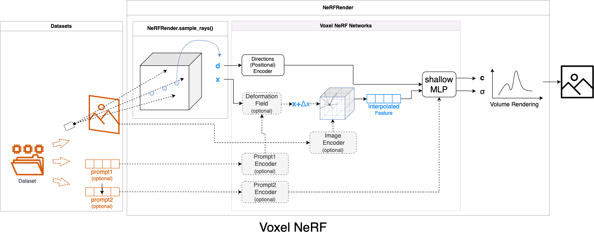

# NeRF-Pytorch
An object-oriented PyTorch implementation of NeRF (Neural Radiance Fields), encapsulated within classes: `dataset`, `network`, `nerf_render`, `loss` and `trainer`. 

All configurations are set in config file: `configs/*.yaml`.
The code structure is inspired by stable-dreamfusion.

>When I work on my NeRF-based projects, I found it a bit complex to customize and organize code blocks. For this concern, I refactor NeRF codes, encapsulated as classes, to facilitate latter usage.

**NeRF structures (aka backbones) to use:*
- ✅ NeRF
- ☐ Voxel based NeRF
  - ✅ [Direct Voxel Grid Optimization (DVGO)](https://github.com/sunset1995/DirectVoxGO): Enhancement techniques were omitted for generalization, thus yielding results not as impressive as original paper.
  - ☐ [Instant Neural Graphics Primitives (Instant-ngp)](https://github.com/NVlabs/instant-ngp)
- ☐ Tri-plane NeRF ([eg3d](https://nvlabs.github.io/eg3d/))
- ☐ Pixel NeRF
## Datasets
To download the datasets, refer to [original NeRF data](https://drive.google.com/drive/folders/128yBriW1IG_3NJ5Rp7APSTZsJqdJdfc1)
## Vanilla NeRF


### Run
```
python run.py --mode=train --config configs/lego.yaml
```

## Voxel / Hashmap NeRF (Working-in-progress)
Initially introduced by [DVGO](https://github.com/sunset1995/DirectVoxGO) and [Plenoxels](https://alexyu.net/plenoxels/), and further popularized through [instant-ngp](https://github.com/NVlabs/instant-ngp), voxel-based NeRF has gained significant community interest due to its superior quality and impressive speed.




<!-- There are many tricks related to voxel-based NeRF.
<details>
<summary>Click to see supported tricks in this repo</summary>

### Per-voxel Learning Rate
</details> -->

## Reference
- [NeRF tensorflow](https://github.com/bmild/nerf/tree/master)
- [NeRF PyTorch](https://github.com/yenchenlin/nerf-pytorch/tree/master)
- [DVGO](https://github.com/sunset1995/DirectVoxGO)
- [stable-dreamfusion](https://github.com/ashawkey/stable-dreamfusion)
