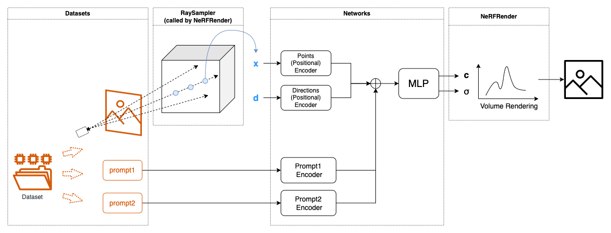

# NeRF-Pytorch
An object-oriented PyTorch implementation of NeRF (Neural Radiance Fields), encapsulated within classes: `dataset`, `network`, `nerf_render`, `loss` and `trainer`. 

All configurations are set in config file: `configs/*.yaml`.

>When I work on my NeRF-based projects, I found it a bit complex to customize and organize code blocks. For this concern, I refactor NeRF codes, encapsulated as classes, to facilitate latter usage.


**Working on Progress:*
- add Tri-Plane NeRF ([eg3d](https://nvlabs.github.io/eg3d/))


## Run
To download the datasets, refer to [original NeRF data](https://drive.google.com/drive/folders/128yBriW1IG_3NJ5Rp7APSTZsJqdJdfc1)
```
python run.py --mode=train --config configs/lego.yaml
```
## Reference
- [NeRF tensorflow](https://github.com/bmild/nerf/tree/master)
- [NeRF PyTorch](https://github.com/yenchenlin/nerf-pytorch/tree/master)
